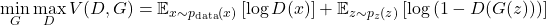

# Generative Adversarial Networks

In this article, we will see how Generative Adversarial Networks (GANs) [1]  work, and how we can use them to generate realistic images.

# 1 - Intro to Generative Adversarial Networks

Generative Adversarial Networks (GANs) were introduced by Ian Goodfellow (2014) as "a new framework for estimating generative models via an adversarial process, in which two models , discriminator and generator, are trained simultaneously."

The discriminator (D) is trained to distinguish between real data samples, drawn from the true data distribution, and fake samples produced by the generator (G).

Through this adversarial process, both models are expected to improve over time: the Discriminator becomes better at detecting fakes, while the Generator learns to produce increasingly realistic images (in other words, the fool ends up being fooled).

# 2 - Underlying theory of GANs

## Generative modeling
Let $x$ be a sample from the real data distribution, such that $x \sim p_{\text{data}}(x)$, where $p_{\text{data}}(x)$ represents the unknown distribution of the real data. 

In probabilistic terms, we want to learn a generative model $p_\theta(x)$, where $\theta$ represents the model parameters. The goal is to optimize $\theta$ such that the model distribution $p_\theta(x)$ approximates the true data distribution $p_{\text{data}}(x)$. But with high-dimensional data (images for instance), directly optimizing $p_\theta(x)$ is intractable (we rarely have an explicit model of the real data or, simply can not assign a likelihood value to $x$).

## The generator
To overcome this issue, the paper introduces a lower-dimensional latent variable $z$, drawn from a known distribution $p_z(z)$, such as a gaussian distribution. $p_z(z)$ are defined as "noise variables" by Goodfellow. 

The idea now, is to define the generative model implicitly by learning a function $G(z,\theta_g)$. G is a differentiable function represented by a multilayer preceptron with parameters $\theta_g$, that maps $z$ to the data space : $x_{\text{fake}} = G(z)$, $z \sim p_z(z)$.

This defines the generator's distribution $p_g$ over $x$. The generator learns a function $G(z)$ that transforms $z$ into data-like outputs, in other terms, it learns to produce samples that look like they came from $p_{\text{data}}(x)$.

## The discriminator
Now, the discriminator, which is also a multilayer perceptron $D(x,\theta_d)$, receives as input either a real data sample $x \sim p_{\text{data}}(x)$ or a generated sample $G(z)$, and outputs single scalar $D(x)$, that represents the probability that $x$ came from the real data rather than from $p_g$. $D(x) \in [0,1]$ by definition.

## The adversarial training
The generator and the discriminator are trained simultaneously in a two-player minmax game with the value function $V(G,D)$.

The discriminator D is trained to maximize the probability of assigning the correct label to both training examples $x$ and samples from G (i.e. G(z), i.e. $x_{\text{fake}}$). In other terms, the discriminator tries to correctly classify inputs as real or fake.

The generator is trained to minimize $log(1-D(G(z)))$. In other terms, the generator tries to produce outputs that are indistinguishable from real data. If the generator becomes so good that $x_{\text{real}} \approx x_{\text{fake}}$, then as $G(z) = x_{\text{fake}}$, we have $D(G(z)) \approx D(x)$. By definition $D(x_{\text{real}}) \approx 1$, which minimizes $log(1-D(G(z)))$.

We can express the two-player minmax game as follows : 

